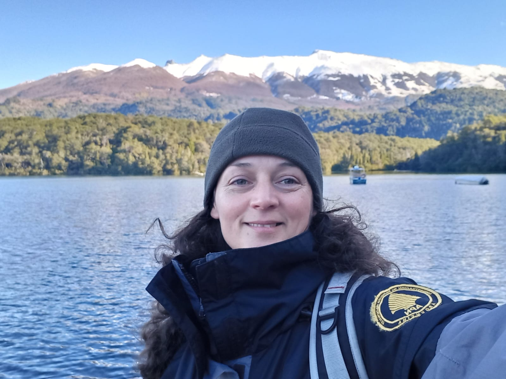
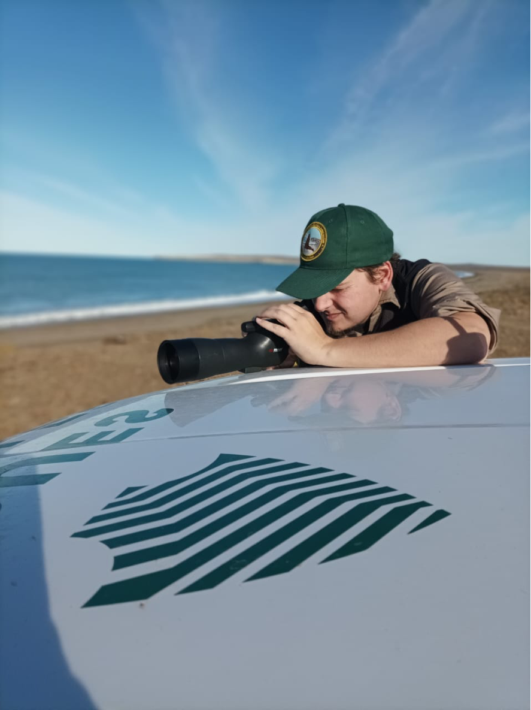
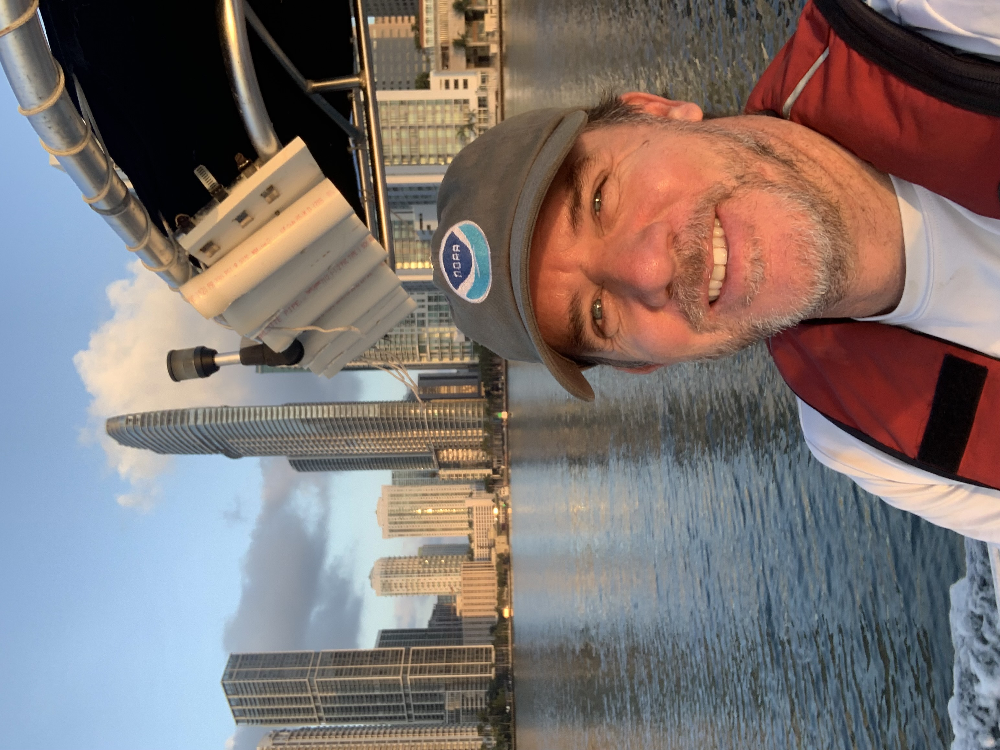

```{r setup, include=FALSE}
knitr::opts_chunk$set(echo = F, message = F, warning = F)
```
<body>

<h3>



**Mariela Gauna** es Licenciada  en Turismo dedicada al trabajo en las áreas protegidas. El privilegio de trabajar en Parques Nacionales la llevó a vivir en Iguazú en la provincia de Misiones, Quebrada del Condorito en Córdoba, Los Alerces en Chubut y actualmente abrazar la estepa y la costa del litoral marino en Monte León, provincia de Santa Cruz. En este recorrido se especializó en la gestión de proyectos de conservación y uso público, planificación de áreas protegidas, y la evaluación de impactos antrópicos en los Parques Nacionales. Desde diciembre del 2021 administra el [Parque Nacional Monte León](https://www.argentina.gob.ar/parquesnacionales/monteleon) e impulsa la creación del Parque Interjurisdiccional Marino Monte León. 

</br>


**Ariel Albertani** es Guardaparque Nacional y Técnico en Áreas Protegidas de Administración de Parques Nacionales especializado en Manejo y Conservación de Áreas Protegidas. Tiene mas de 25 años al servicio de la conservación, con experiencia en el manejo de áreas protegidas continentales como el Parque Nacional Los Alerces, Sitio de Patrimonio Natural de la Humanidad, donde me formó en todas las tareas propias de la función, control y vigilancia, patrullaje, fiscalización, monitoreo, educación ambiental, manejo de personal y de grupos, liderazgo, atención de emergencias, planificación, administración y gestión. Ariel es aficionado a la náutica, el buceo y las actividades al aire libre. Desde mediados del 2020 administra el [Parque Interjurisdiccional Marino Isla Pingüino](https://www.argentina.gob.ar/parquesnacionales/islapinguino), ubicado al Noroeste de la Provincia de Santa Cruz con una superficie de 159.526ha de mar, sobre el litoral patagónico. 

</br>


**Gregorio Bigatti**  obtuvo su titulo de Licenciado y finalizó su Doctorado en Ciencias Biológicas en la Facultad de Ciencias Exactas y Naturales de la Universidad de Buenos Aires (UBA). Actualmente es Investigador Principal de CONICET, con lugar de trabajo en el Instituto de Biología de Organismos Marinos en el CCT CONICET-CENPAT, de la ciudad de Puerto Madryn donde fundó el Laboratorio de Reproducción y Biología Integrativa de Invertebrados Marinos (LARBIM) en el año 2007. Es profesor adjunto de la Universidad Nacional de la Patagonia San Juan Bosco (UNPSJB). Participa activamente en el proyecto ([MBON](https://marinebon.org/])) desde sus inicios siendo encargado de muestreos en la Patagonia Argentina. A su vez realiza actividades de divulgación científica y educación focalizadas en la conservación de los ambientes costeros marinos. 

<br>


**Gonzalo Bravo** es licenciado en Ciencias Biológicas de la UNPSJB , Magister en Oceanografía de la Universidad de Quebec en Rimouski y actual estudiante doctoral del CONICET. Gonzalo es buzo científico con más de 3000 buceos en aguas patagónicas, ha participó en expediciones científicas en el Ártico, en las Islas Galápagos, Canal Beagle, e Isla de Los Estados. Entre sus búsquedas académicas se encuentra la inclusión de la Inteligencia Artificial para analizar imágenes del fondo marino.

<br>


**Erasmo Macaya** es biólogo marino dedicado al estudio de las macroalgas marinas en aspectos como la ecología, taxonomía y biodiversidad. Ha recorrido gran parte de la costa chilena documentado la diversidad de algas, participando en diversas expediciones al Archipiélago Juan Fernández, Magallanes, Rapa Nui (Isla de Pascua) y Antártica. Es co-autor de dos libros de macroalgas marinas (Guía de Algas Subantárticas y Guía de Macroalgas de Ushuaia), y autor de una Guía Fotográfica de Algas de Chile y ha publicado más de 60 artículos científicos y capítulos de libros. Es Investigador Asociado del Centro IDEAL y Profesor Asociado de la Universidad de Concepción donde dirige el Laboratorio de Estudios Algales.

</br>



**Ian Walker** biólogo graduado en la Universidad Nacional de Córdoba. Actualmente trabaja en el Departamento de Conservación y Uso Público del Parque Interjurisdiccional Marino Makenke (PIMM).

<br>



**Enrique Montes** es oceanógrafo biológico del Instituto Cooperativo de Estudios Marinos y Atmosféricos ([CIMAS](https://cimas.earth.miami.edu/)) de la Universidad de Miami, y  el Laboratorio Oceanográfico y Meteorológico del Atlántico ([AOML](https://www.aoml.noaa.gov/)) de la NOAA. Su investigación explora las respuestas de la vida marina a cambios en las condiciones atmosféricas y oceanográficas integrando mediciones medioambientales, bioópticas, genómicas y taxonómicas *in situ* con datos  satelitales para entender el contexto oceanográfico de observaciones locales y caracterizar la biogeografía regional.  Es Co-investigador de la Red de Observación de la Biodiversidad Marina ([MBON](https://marinebon.org/])) en Estados Unidos y a escala internacional, y el Investigador Principal de la Red MBON Polo a Polo de las Américas ([MBON Pole to Pole](https://marinebon.github.io/p2p/index.html)). Enrique es miembro del Comité Ejecutivo de la Asociación Internacional de Oceanografía Biológica ([IABO](http://iabo.org/)) y de la Asociación Mundial de Estaciones Marinas ([WAMS](https://worldmarinestations.com/)).


</h3>

</body>


