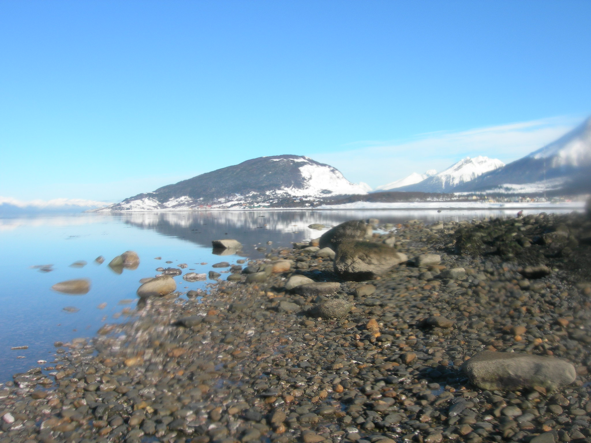
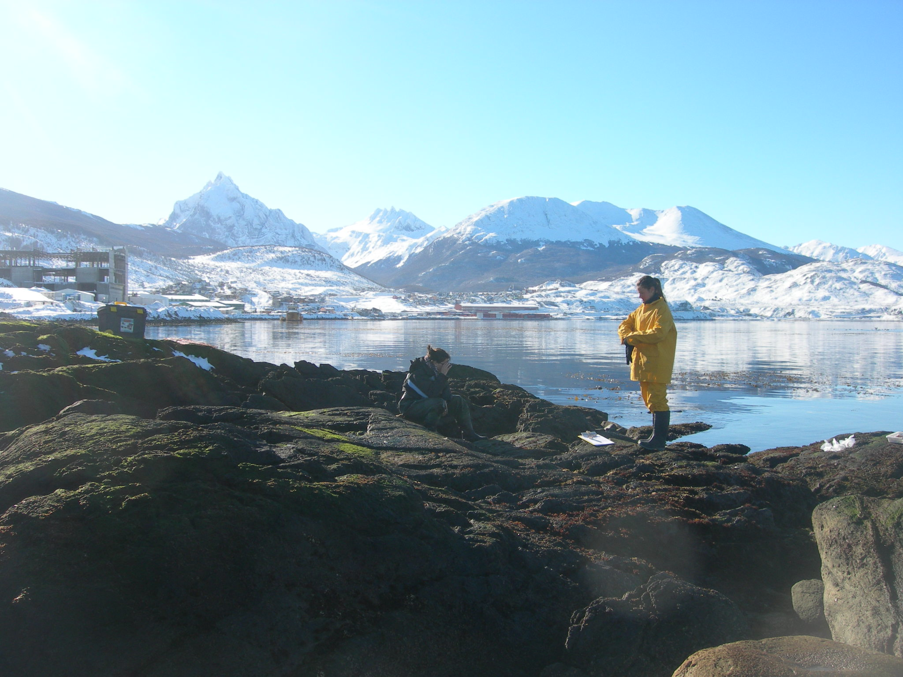

```{r setup, include=FALSE}
knitr::opts_chunk$set(echo = F, message = F, warning = F, fig.width=9.5, fig.height=12)
```

<body>

<h2>

# [Red de Observación de Biodiversidad Marina Polo a Polo de las Américas (MBON Pole to Pole)](https://marinebon.github.io/p2p/index.html)

## Fechas: 22-27 de enero, 2024

## Lugar: Ushuaia, Tierra del Fuego - Argentina

<br>

[](https://marinelife2030.org/)

</h2>

</body>

<body>

<h3>

Este taller capacitará a estudiantes y profesionales dedicados a la conservación y manejo de recursos vivos en el uso de técnicas de monitoreo de biodiversidad  marina en litoral rocoso intermareal utilizando imágenes (foto-cuadrantes) procesadas con Inteligencia Artificial para clasificación de especies bentónicas.  La actividad busca co-implementar una red de monitoreos de biodiversidad iniciados en la Patagonia Argentina hacia la costa de Chile con el apoyo de Guardafaunas y Guardaparques de [Parques Nacionales](https://www.argentina.gob.ar/parquesnacionales) y [Áreas Naturales Protegidas](https://chubutpatagonia.gob.ar/areas-naturales-protegidas/), y personal científico entrenados en estas técnicas en un primer taller llevado a cabo del 27 al 31 de marzo del 2023 en [Camarones, Chubut](https://eqmh.github.io/p2p-argentina-workshop/).
</br> <br> 
Esta actividad facilitará la creación de una red de trabajo entre Guardafaunas, Guardaparques y
científicos para monitorear los cambios a largo plazo en los ecosistemas
intermareales de fondos rocosos de Chile y Argentina, y aportar datos y
conocimiento a gestores ambientales y al programa
internacional de monitoreo de biodiversidad [MBON Pole to
Pole](https://marinebon.github.io/p2p/index.html). 
</br> <br> 
Al final del taller los participantes estarán en capacitadad de implementar
herramientas para el monitoreo de condiciones medioambientales y
biodiversidad desarrolladas por el CENPAT y otros grupos de la región en
el marco del proyecto [MBON Pole to Pole](https://marinebon.github.io/p2p/index.html).

</br>

</h3>

</body>



<body>

<h3>

La recopilación de datos de imágenes basada en colecciones de
foto-cuadrantes se está utilizando ampliamente para estimar la cobertura
y la densidad de algas e invertebrados marinos en costas rocosas y
hábitats sumergidos. El programa [MBON Pole to
Pole](https://marinebon.github.io/p2p/index.html) está impulsando la
adopción de herramientas de seguimiento de la biodiversidad con la toma
de foto-cuadrantes a lo largo de las Américas. El procesamiento y
análisis de imágenes se ha realizado normalmente de forma manual, por lo
que la extracción de información taxonómica a partir de imágenes
requiere un sistema automatizado para ser operativo. Los recientes
avances en las herramientas de *machine learning* y la transición a la
automatización parcial o total de las anotaciones de las imágenes de
foto-cuandrantes surgen como una solución a este desafío.

<br>

En respuesta a esta necesidad, este segundo taller proveerá de entrenamiento técnico para la
toma de imágenes de foto-cuadrantes utilizando métodos estandarizados y
el procesamiento de imágenes utilizando el software
[CoralNet](https://coralnet.ucsd.edu/) para la anotación automatizada de
especies y la publicación de registros taxonómicos basados en imágenes
en el Sistema de Información sobre Biodiversidad Oceánica
([OBIS](https://obis.org/)). Este taller tiene como objetivos: -
Acelerar la transición de anotaciones manuales a automatizadas de
foto-cuadrantes; - Entrenar a los participantes en herramientas de
monitorización de la biodiversidad de los hábitats bentónicos; - Formar
a los participantes en el manejo de flujo de datos para la generación de
reportes de biodiversidad

</h3>

</body>


