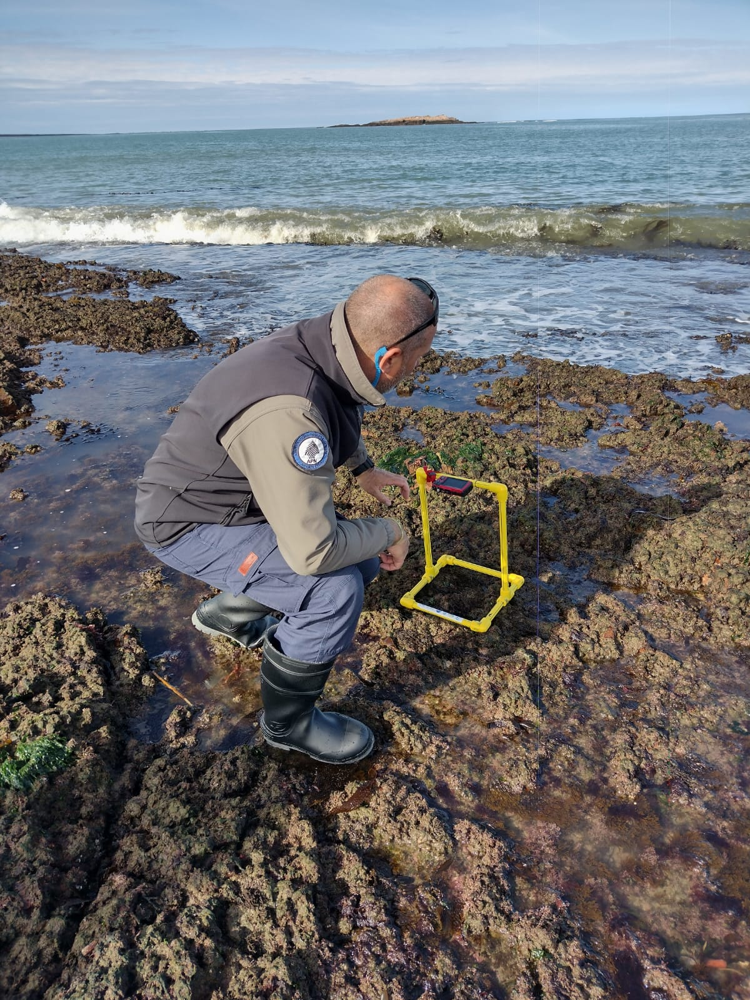

```{r setup, include=FALSE}
knitr::opts_chunk$set(echo = F, message = F, warning = F)
library(tidyverse)
library(readxl)
library(knitr)
```



<body>

<h2>

# El taller contará con la participación de Guardaparques y Guardafaunas de [Parques Nacionales](https://www.argentina.gob.ar/parquesnacionales) de Argentina, Universidad de Concepción, Universidad de Valparaíso, y personal de la [Wildlife Conservation Society](https://chile.wcs.org/) de Chile:

- [Monte León](https://www.argentina.gob.ar/parquesnacionales/monteleon)
- [Parques Interjurisdiccionales Marino Costero Patagonia Austral](https://www.argentina.gob.ar/parquesnacionales/marinocostero): 
  + [Isla Pingüino](https://www.argentina.gob.ar/parquesnacionales/islapinguino)
- [Parque Karukinka](https://chile.wcs.org/Karukinka.aspx)

</h2>

</body>


