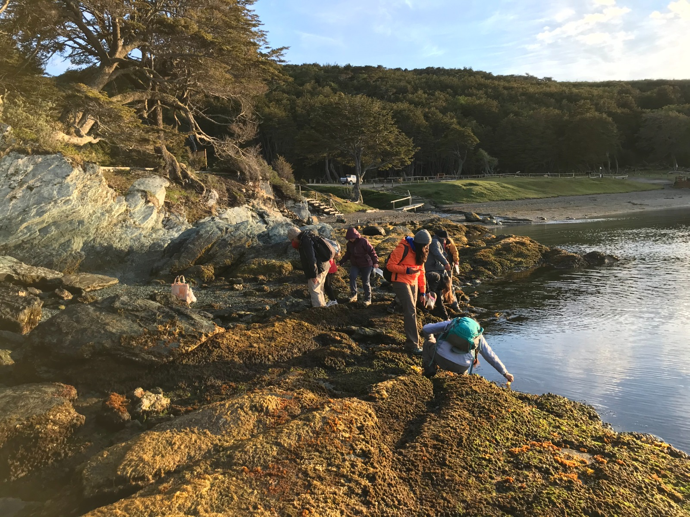
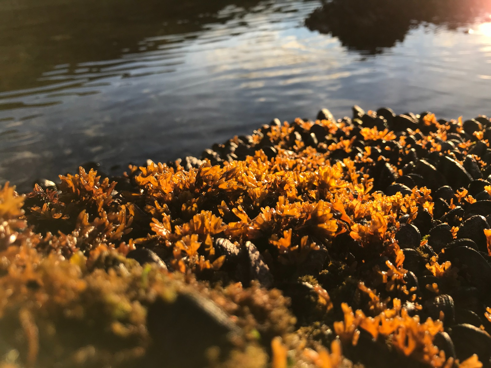
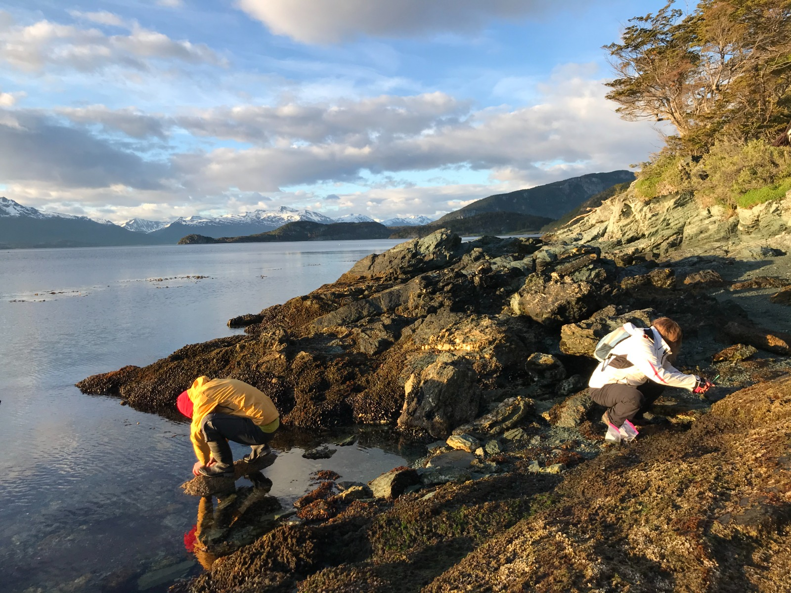
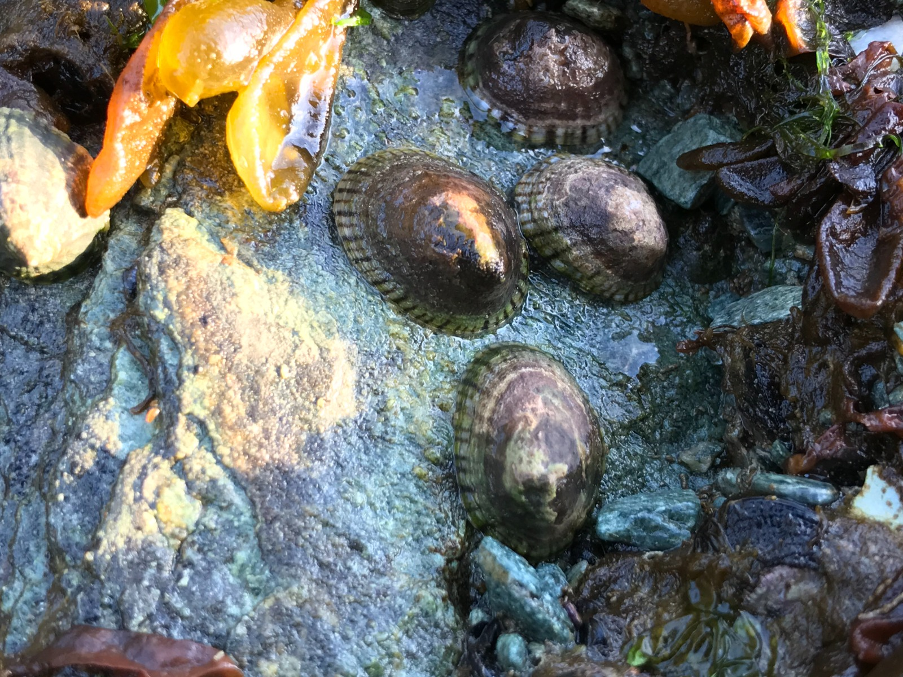
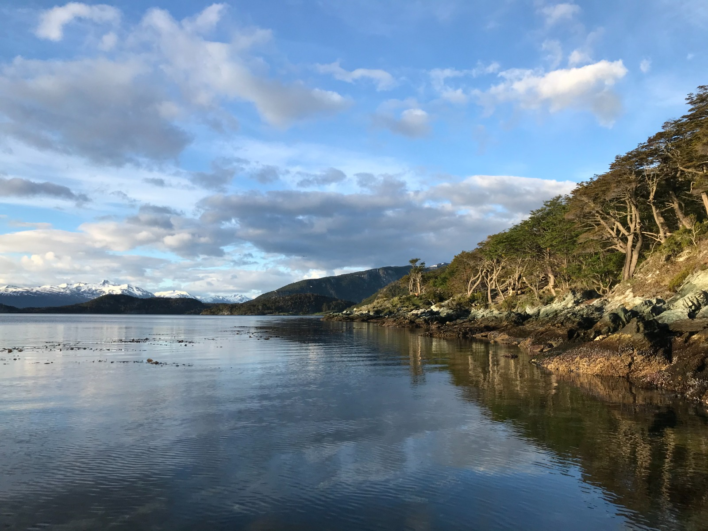
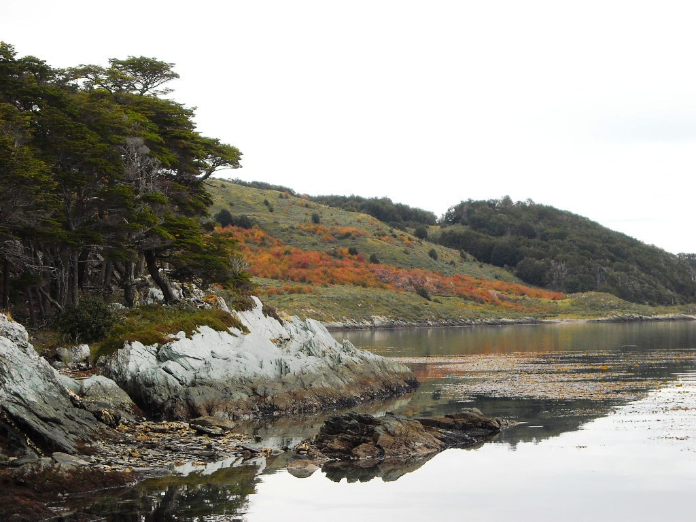

```{r setup, include=FALSE}
knitr::opts_chunk$set(echo = F, message = F, warning = F)
```


<body>

<h2>

## **DIA 1 -- Lunes 22 de enero**

-   Teoría sobre biodiversidad de ambientes intermareales rocosos de Patagonia
-   Protocolos de muestreo de biodiversidad del litoral rocoso con foto-cuadrantes
-   Demostración de datos previos y plataforma MBON para detectar cambios de biodiversidad <br> <br>

## **DIA 2 -- Martes 23 de enero** 

-   Muestreo del intermareal con fotocuadrantes en Bahía de Ushuaia
-   Uso de cámaras y equipos para muestreo de biodiversidad intermareal 
-   Optimización de fotografías para utilizar inteligencia artificial, uso de software de imágenes 
-   Utilización de software de inteligencia artificial para análisis de biodiversidad marina <br> <br>

## **DIA 3 -- Miércoles 24 de enero** 

-   Muestreo del intermareal con foto-cuadrantes en [Parque Nacional Tierra del Fuego](https://turismoushuaia.com/zonas/parque-nacional/) (Lapataia)
-   Trabajo en grupos: Optimización de fotografías y uso de software de inteligencia artificial para análisis de biodiversidad marina <br> <br>

## **DIA 4 -- Jueves 25 de enero** 

-   Continuación de análisis de fotografías digitales con IA tomadas durante la capacitación
-   Manejo de imágenes y metadatos
-   Generación de reporte de indicadores de biodiversidad con [tableros interactivos](https://marinebon.github.io/p2p-dashboard/biodivExplorer_beach.html#general-information) <br> <br>

## **DIA 5 -- Viernes 26 de enero** 

-   Análisis grupal de los datos subidos, comparaciones con otros datos de Argentina
-   Discusión acerca de aplicación de resultados al manejo de ecosistemas costeros e implementación en Áreas Protegidas Marinas
-   Coordinación de muestreos futuros en las distintas localidades en Tierra del Fuego y la costa de Chile.
-   Entrega formal de equipamiento para muestreo a largo plazo <br> <br>

## [**Agenda detallada**](Taller_fotocuadrantes_TDF_agenda.pdf)
<br>
<br>
```{r}
library(tidyverse)
library(leaflet)
library(sf)

pts <- tribble(
        ~lon,       ~lat,       ~name,    ~icon,   ~color,          ~description, ~comment,
  -68.3289, -54.8225,  "CADIC", "home", "red", "CADIC", NA,
  -68.4845, -54.8475,  "Ensenada Zaratiegui", "child", "orange", "Ensenada Zaratiegui", NA,
  -68.47122, -54.83394, "Estación Parque Nacional Tierra del Fuego", "home", "blue", "Parque Natl. TDF", NA) %>%
  st_as_sf(coords = c("lon", "lat"), crs = 4326)
ctr <- pts$geometry %>% st_geometrycollection() %>% st_centroid() %>% st_coordinates()
icons <- awesomeIcons(
  icon = pts$icon,
  iconColor = 'black',
  library = 'fa',
  markerColor = pts$color)
leaflet(pts, options = leafletOptions(attributionControl=F), height=600, width=1000) %>%
  #addProviderTiles(provider = providers$Stamen.TonerLite) %>%
  addProviderTiles("Esri.WorldImagery") %>%
  addAwesomeMarkers(icon = icons, label= ~name, labelOptions = labelOptions(noHide = T)) %>%
  setView(ctr[,"X"], ctr[,"Y"], zoom=11)
```
 <br> <br>

## **Localidad para el entrenamiento de campo del taller: Ensenada Zaratiegui**

 

 

 

 

 

 <br>


</h2>

</body>


